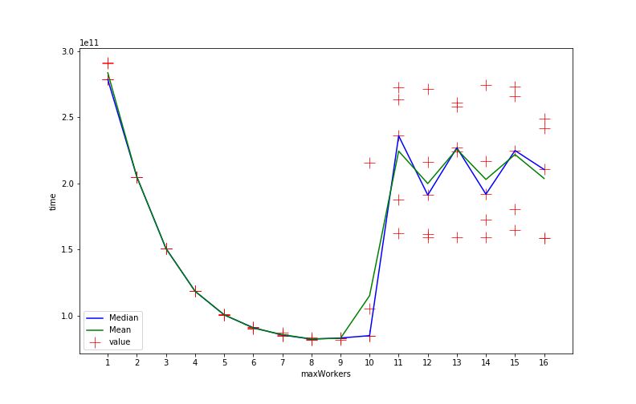
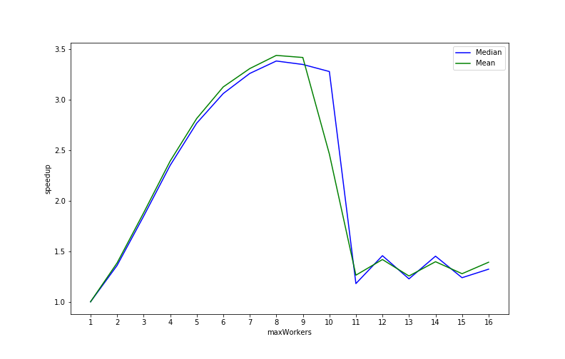

# Scala Akka Prime SpeedUp

**Simple prime calculator (written in scala, based on akka) to benchmark speedUp on different amount of workers.**

Tested on ``macOs`` and ``Ubuntu Server 20.04 LTS`` with ``openjdk64-13``

Author: [Maximilian Bundscherer](https://bundscherer-online.de)

## Test-Run

- See [jupyter notebook](./reports/report.ipynb)
- Tested on ``aws ec2 t2.xlarge (4vCPU, 16GB ram)``
- Tested on ``Ubuntu Server 20.04 LTS (HVM), SSD Volume Type (ami-0b90a8636b6f955c1)``
- Param [maxWorkersPerRun](./src/main/scala/de/maxbundscherer/akka/scala/prim/Main.scala) ``Vector(1,2,3,4,5,6,7,8,9,10,11,12,13,14,15,16)``
- Param [repeatRun](./src/main/scala/de/maxbundscherer/akka/scala/prim/Main.scala) ``5``

### Time

### SpeedUp

## Let's get started (local)

- Clear results in ``./results.csv``
- See [config](./src/main/scala/de/maxbundscherer/akka/scala/prim/Main.scala)
- Run ``sbt run``
- See results in ``./results.csv``

## Let's get started (ec2 instance)

- Install dependencies - run [script-file](./ec2-install.sh)
- Clear results in ``./results.csv``
- See [config](./src/main/scala/de/maxbundscherer/akka/scala/prim/Main.scala)
- Start auto run [script-file](./ec2-run.sh)
- See results in ``./results.csv``
